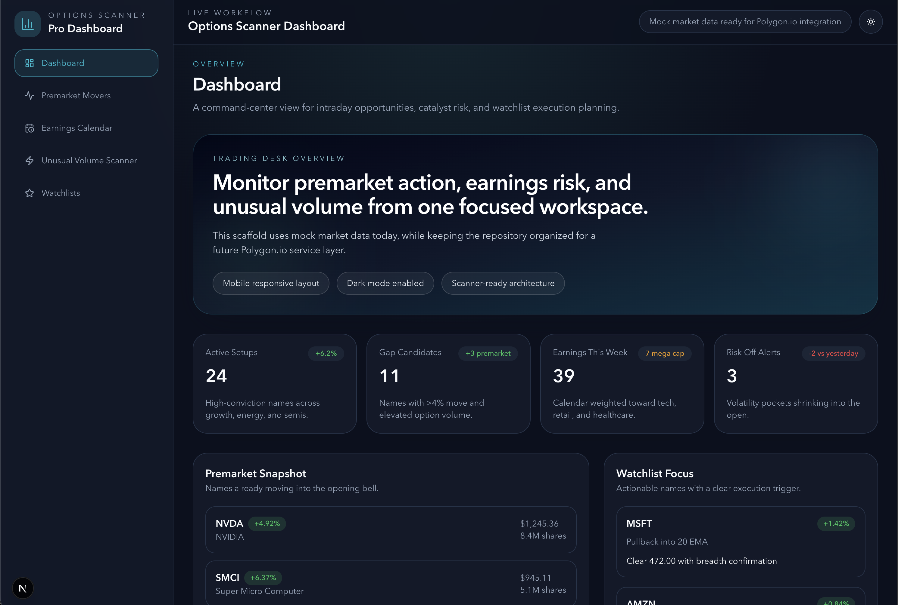
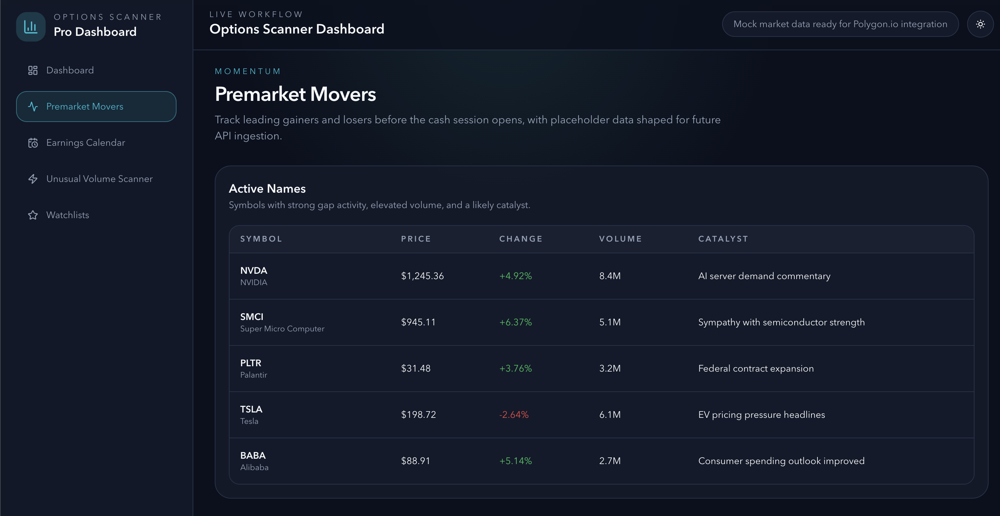
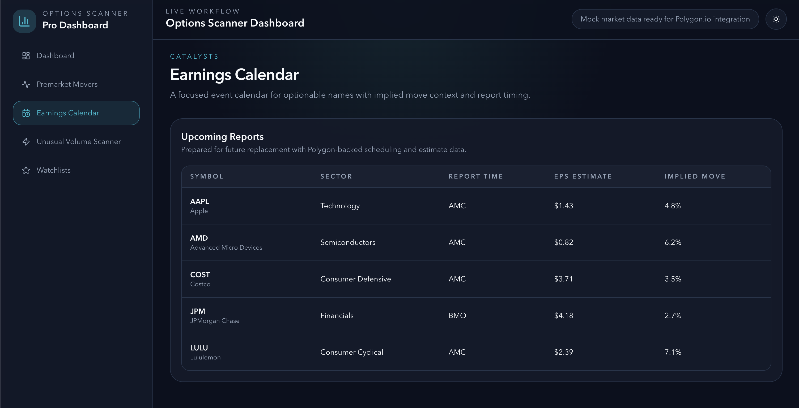
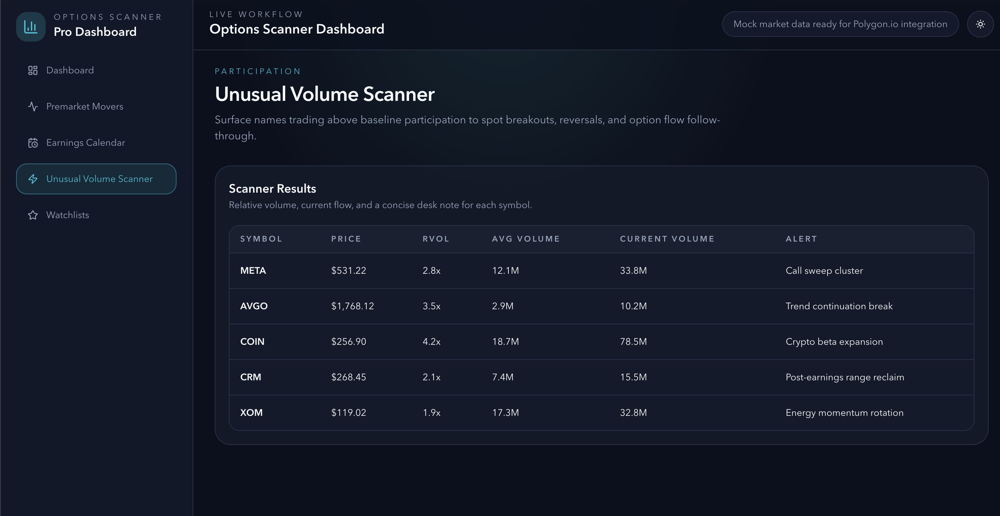
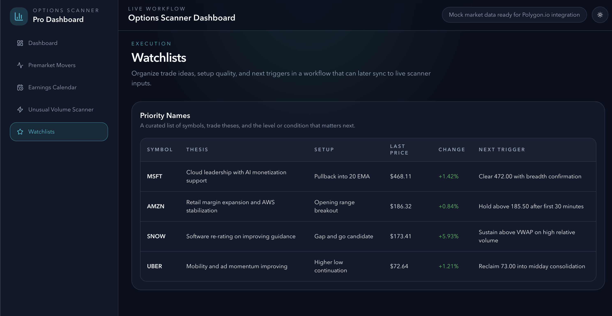

# Options Scanner Dashboard

A portfolio-quality trading dashboard built with Next.js 15, TypeScript, and Tailwind CSS to demonstrate product thinking, front-end architecture, and a scalable path from mock data to live market integrations.

This project presents a professional options scanning workflow across premarket momentum, earnings catalysts, unusual volume, and execution watchlists. The current implementation uses structured mock data, while the repository is organized so a future Polygon.io integration can be introduced without rewriting the page layer.

## Why This Project Stands Out

- Built with the Next.js 15 App Router and strict TypeScript typing
- Uses a reusable data repository pattern that can swap mock sources for live APIs
- Includes dark mode, responsive layouts, and consistent dashboard UI primitives
- Organizes scanner workflows into distinct, recruiter-friendly product surfaces
- Includes unit tests for shared utilities and reusable UI components

## Product Surfaces

- `Dashboard` for a high-level view of active setups, scanner health, and market context
- `Premarket Movers` for gappers, catalysts, and early participation signals
- `Earnings Calendar` for scheduled catalysts and implied move monitoring
- `Unusual Volume Scanner` for relative volume spikes and momentum confirmation
- `Watchlists` for discretionary trade planning and execution triggers

## Tech Stack

- `Next.js 15`
- `React 19`
- `TypeScript`
- `Tailwind CSS`
- `next-themes` for dark mode
- `Vitest` and `Testing Library` for unit tests

## Screenshots

### Dashboard Command Center



### Premarket Momentum Monitor



### Earnings Catalyst Calendar



### Unusual Volume Intelligence



### Trade Watchlist Workspace



## Architecture Highlights

### App Router Structure

The application uses the Next.js App Router for route-based page composition, shared layout handling, and clean separation between route segments.

### Reusable Component System

Common UI patterns such as navigation, page headers, cards, tables, and status badges are split into reusable components to keep pages focused on product logic rather than repeated markup.

### Future-Ready Data Layer

Mock market data is isolated behind a repository-style interface in [`lib/data/index.ts`](./lib/data/index.ts). The placeholder Polygon adapter in [`lib/data/polygon-adapter.ts`](./lib/data/polygon-adapter.ts) shows where live fetchers would be introduced later.

This allows the UI layer to stay stable while the backing data source evolves from mock JSON to real-time or REST-based market services.

## Project Structure

```text
.
├── app
│   ├── earnings-calendar
│   │   └── page.tsx
│   ├── premarket-movers
│   │   └── page.tsx
│   ├── unusual-volume-scanner
│   │   └── page.tsx
│   ├── watchlists
│   │   └── page.tsx
│   ├── globals.css
│   ├── layout.tsx
│   └── page.tsx
├── components
│   ├── layout
│   │   ├── app-shell.tsx
│   │   ├── sidebar.tsx
│   │   └── topbar.tsx
│   ├── market
│   │   ├── dashboard-hero.tsx
│   │   └── signal-badge.tsx
│   ├── providers
│   │   └── theme-provider.tsx
│   ├── theme-toggle.tsx
│   └── ui
│       ├── data-table.tsx
│       ├── page-header.tsx
│       ├── section-card.tsx
│       └── stat-card.tsx
├── lib
│   ├── data
│   │   ├── index.ts
│   │   ├── mock-market-data.ts
│   │   └── polygon-adapter.ts
│   ├── types
│   │   └── market.ts
│   └── utils.ts
├── public
│   └── screenshots
│       ├── dashboard.png
│       ├── earnings-calendar.png
│       ├── premarket-movers.png
│       ├── unusual-volume-scanner.png
│       └── watchlists.png
├── tests
│   ├── components
│   │   ├── data-table.test.tsx
│   │   └── stat-card.test.tsx
│   ├── lib
│   │   └── utils.test.ts
│   └── setup.ts
├── .eslintrc.json
├── .gitignore
├── next-env.d.ts
├── next.config.ts
├── package.json
├── postcss.config.js
├── tailwind.config.ts
├── tsconfig.json
└── vitest.config.ts
```

## Local Development

1. Install dependencies:

```bash
npm install
```

2. Start the development server:

```bash
npm run dev
```

3. Open the app at [http://localhost:3000](http://localhost:3000).

## Available Scripts

- `npm run dev` starts the local development server
- `npm run build` creates a production build
- `npm run start` runs the production server
- `npm run lint` runs ESLint across the project
- `npm run test` runs the unit test suite
- `npm run test:watch` runs Vitest in watch mode

## Testing

The test suite currently covers:

- formatting helpers in [`lib/utils.ts`](./lib/utils.ts)
- reusable table rendering in [`components/ui/data-table.tsx`](./components/ui/data-table.tsx)
- dashboard metric card rendering in [`components/ui/stat-card.tsx`](./components/ui/stat-card.tsx)

## Deployment

### Vercel

1. Push the repository to GitHub.
2. Import the repository into [Vercel](https://vercel.com/).
3. Add future environment variables such as `POLYGON_API_KEY` when live integrations are introduced.
4. Deploy with the default Next.js build settings.

### Manual Production Build

```bash
npm install
npm run build
npm run start
```

## Extending to Polygon.io

To move from mock data to a live market integration:

1. Implement live fetchers in [`lib/data/polygon-adapter.ts`](./lib/data/polygon-adapter.ts).
2. Switch the export in [`lib/data/index.ts`](./lib/data/index.ts) from mock sources to Polygon-backed sources.
3. Preserve the existing repository contract so pages and components continue to work unchanged.

## What Recruiters and Hiring Managers Can Evaluate Here

- Front-end architecture and code organization
- Design consistency across multiple dashboard surfaces
- Responsiveness and dark mode implementation
- Separation of product UI from service/data concerns
- Readiness for API-driven extension and production deployment

## Next Iterations

- Replace mock services with Polygon.io REST and websocket integrations
- Add filter controls for sector, float, and options flow
- Introduce charting for intraday context and historical comparisons
- Add authentication and persistent personal watchlists
